# TMS6064 Cyber Security – Assignment 1

## Disclaimer
This project is conducted strictly for educational purposes in a controlled lab environment using virtual machines and authorized targets only.

---

## Student Information

- **Name:** ZAEIM HUZAIRY  
- **Matric Number:** 25030303  
- **Course:** TMS6064 Cyber Security  

---

# Task 1: Reconnaissance Phase

Reconnaissance is the initial phase of penetration testing where information about a target system is gathered to support further security assessment.

### Tools Used:
- Nmap
- Recon-ng
- DNSRecon
- Hping3

---
## 1️⃣ Nmap – Network Scanning

### Target Selection
The loopback address `127.0.0.1` (localhost) was used to ensure all scanning activities were performed safely within the lab environment.

### Features Demonstrated
- Basic TCP Port Scan  
- Service and Port Detection  
- Host Availability Detection  

### Purpose
Nmap is used to discover open ports and identify exposed services on a target system. It helps penetration testers determine potential attack surfaces.

### Security Relevance
Identifying open services allows security professionals to evaluate which services require hardening or further vulnerability testing.

### Conclusion
Nmap provides essential network intelligence including port exposure and service availability. It is a foundational tool in reconnaissance activities.

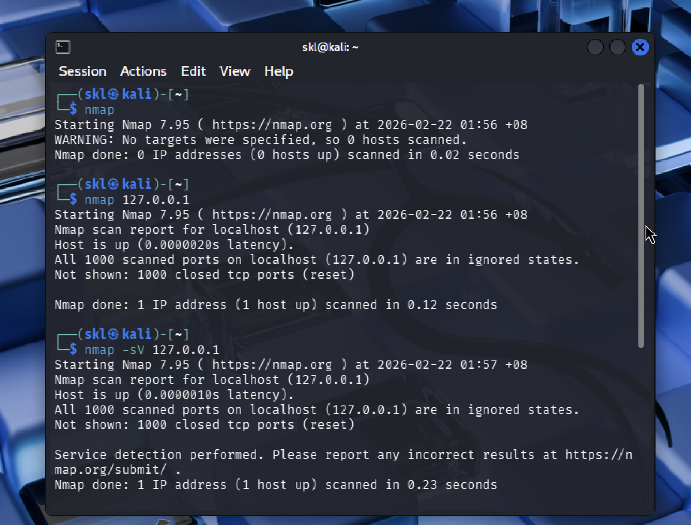

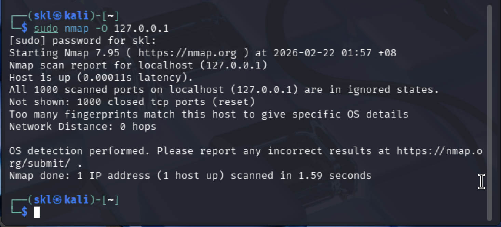

### Target Selection

For this exercise, the loopback IP address `127.0.0.1` (localhost) was used as the scanning target. This ensures that all reconnaissance activities were conducted within a controlled and authorized lab environment without targeting external or third-party systems.## Conclusion for Nmap

Nmap is a powerful reconnaissance tool that allows penetration testers to identify open ports, detect service versions, and determine operating system information. It provides critical intelligence that supports further exploitation phases in penetration testing.

---
## 2️⃣ Recon-ng – OSINT Framework

### Features Demonstrated
- Marketplace Search  
- Module Installation and Loading  
- Domain Enumeration using Defined Source  

### Purpose
Recon-ng is used for structured open-source intelligence (OSINT) gathering. It organizes reconnaissance activities into workspaces and modules.

### Security Relevance
It allows systematic domain intelligence collection while maintaining proper data organization, making it suitable for professional engagements.

### Conclusion
Recon-ng enhances reconnaissance by providing a modular and database-driven framework for domain intelligence gathering.

Step 1 - marketplace search
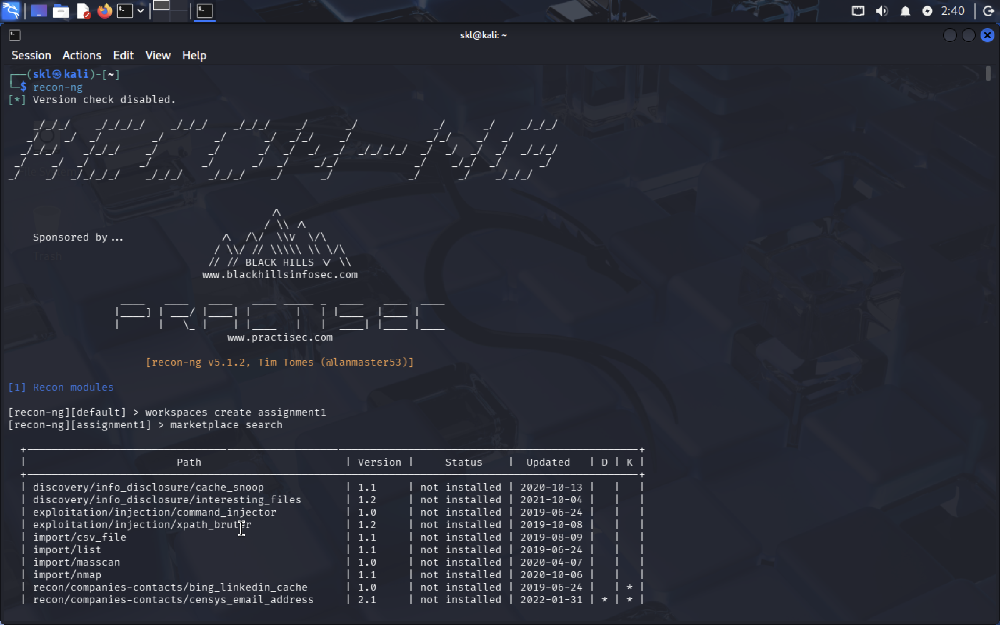

Step 2 - module install and load
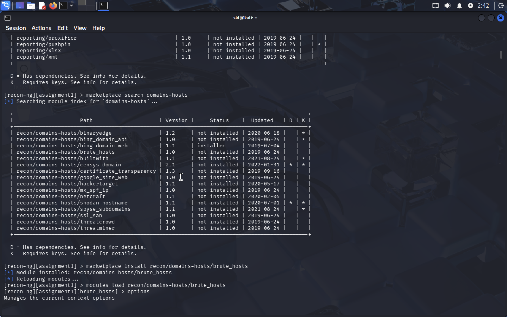

Step 3 - insert and fix domain in options + run
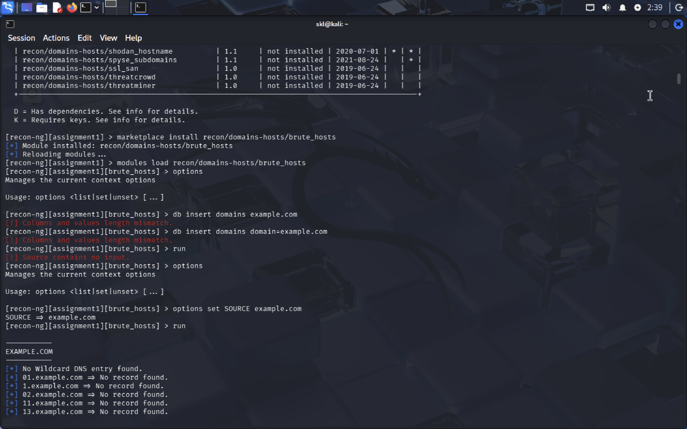

The `options set SOURCE` command defines the target domain for enumeration.  
The `run` command executes the selected reconnaissance module against the specified domain.

Recon-ng is a modular reconnaissance framework designed for open-source intelligence (OSINT) gathering. Unlike single-command tools, Recon-ng provides a structured environment with workspaces, module management, and database integration to organize reconnaissance activities efficiently.

Through marketplace search, module installation, module loading, and execution using defined options, the framework demonstrates how reconnaissance can be conducted in a systematic and organized manner. The workspace feature further enhances project separation and data management.

Overall, Recon-ng is powerful for domain enumeration and intelligence gathering, making it highly suitable for structured penetration testing engagements.

---
## 3️⃣ DNSRecon – DNS Enumeration

### Features Demonstrated
- Basic DNS Enumeration  
- Zone Transfer Attempt (AXFR)  
- Name Server Record Discovery  

### Purpose
DNSRecon gathers publicly available DNS information including A records, AAAA records, and name server configurations.

### Security Relevance
It helps assess how much infrastructure information is exposed via DNS. Failed zone transfers indicate proper DNS hardening.

### Conclusion
DNSRecon is effective for identifying domain infrastructure exposure and verifying DNS security configurations.

Feature 1 - basic enumeration
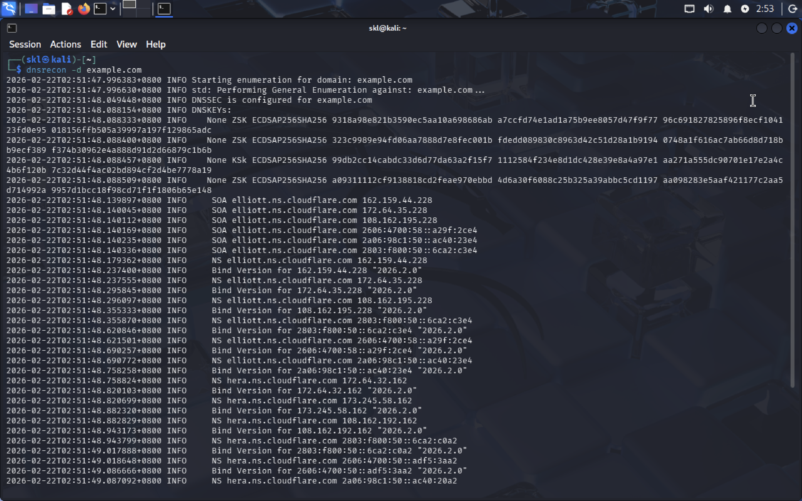
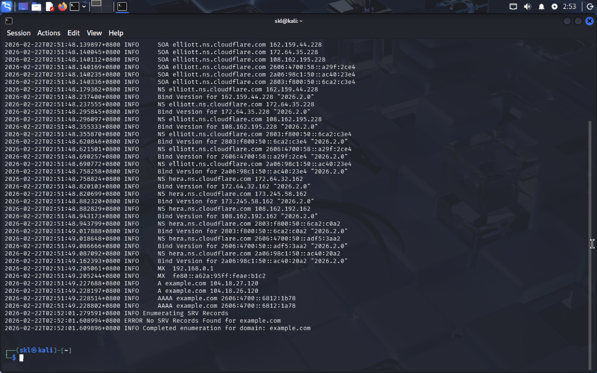

Feature 2 - zone transfer 
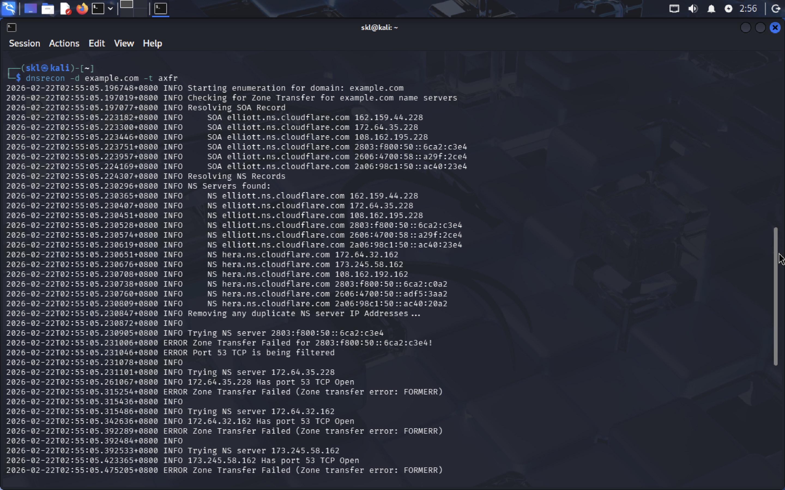
The zone transfer attempt failed because the DNS server does not allow unauthorized AXFR requests. This indicates proper DNS security configuration. In penetration testing, failed zone transfers are common and demonstrate that the DNS server is not misconfigured.

Conclusion for DNSRecon

DNSRecon is an effective DNS enumeration tool used during the reconnaissance phase of penetration testing. It allows security professionals to gather critical domain information such as A records, AAAA records, name servers, and other DNS-related data.

Through basic enumeration, zone transfer attempts, and brute-force subdomain discovery, DNSRecon demonstrates how attackers may attempt to extract valuable infrastructure information from DNS servers. Even when zone transfer attempts fail, it confirms that proper security configurations are in place.

Overall, DNSRecon provides valuable insight into domain configurations and potential exposure points, making it an important tool in reconnaissance activities.

---
## 4️⃣ Hping3 – Packet Crafting Tool

### Features Demonstrated
- ICMP Testing  
- TCP SYN Packet Testing  
- Specific Port Probing  

### Purpose
Hping3 is used to send custom-crafted packets to evaluate firewall behavior and network responses.

### Security Relevance
It allows low-level testing of port accessibility and firewall filtering mechanisms.

### Conclusion
Hping3 provides deeper insight into network behavior and complements traditional scanning tools like Nmap.

---

### Feature 1: Basic ICMP Ping
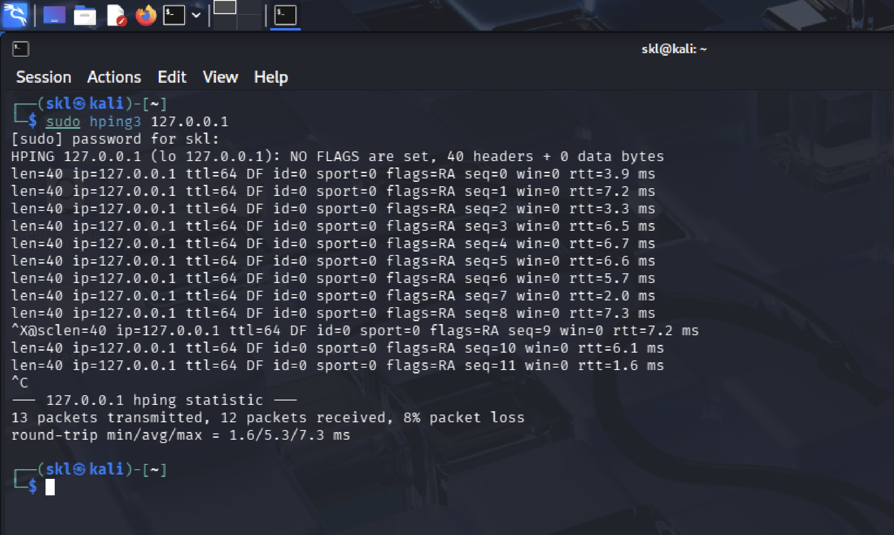

Feature 2 - TCP SYN Packet to Specific Port
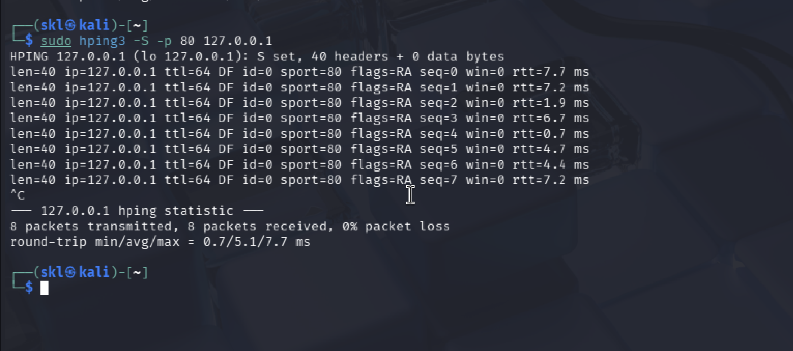

Feature 2 - Scan specific port to once
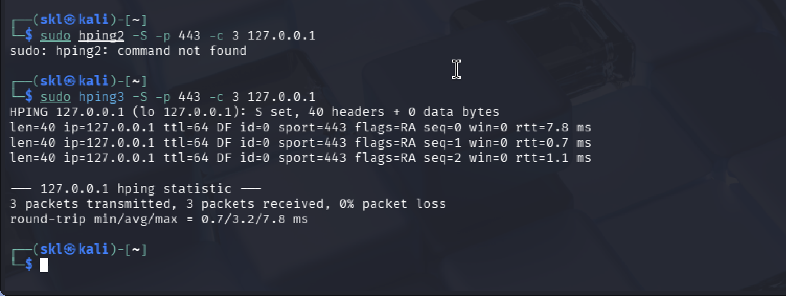

Conclusion for Hping3

Hping3 allows penetration testers to craft and send custom network packets to evaluate system responses and firewall behavior. It is useful for low-level network probing and testing port accessibility during reconnaissance.

# Tool Comparison and Overall Conclusion

Each reconnaissance tool serves a different purpose during penetration testing:

- Nmap focuses on network scanning, port discovery, and service detection.
- Recon-ng provides structured OSINT gathering through modular domain intelligence collection.
- DNSRecon specializes in DNS enumeration and domain record analysis.
- Hping3 allows low-level packet crafting and network probing for firewall and port testing.

Nmap and DNSRecon are primarily focused on technical network enumeration. Recon-ng is more structured and suitable for organized intelligence gathering projects. Hping3 operates at a lower network layer, allowing detailed packet manipulation and testing.

##  Task 1 Tool Comparison

| Tool      | Focus Area                 | Strength                              |
|-----------|----------------------------|----------------------------------------|
| Nmap      | Port & Service Discovery   | Broad network scanning                 |
| Recon-ng  | OSINT Collection           | Structured intelligence framework      |
| DNSRecon  | DNS Analysis               | Domain record exposure testing         |
| Hping3    | Packet Crafting            | Firewall & port behavior testing       |

---

##  Overall Task 1 Conclusion

Combining these four tools provides a comprehensive reconnaissance strategy covering:

- Network scanning  
- DNS analysis  
- Structured OSINT gathering  
- Low-level packet testing  

Each tool complements the others in building a complete understanding of the target environment.

---

# References

1. How to Install Linux on Mac. (n.d.). YouTube. https://youtu.be/bcaF1OSivYI?si=RcfSMhyXuvbSTU6a  

2. Nmap Tutorial for Beginners. (n.d.). YouTube. https://youtu.be/W7076RPIgfQ?si=DRO1e0qxH0lg2bcy  

3. Recon-ng Tutorial and Usage Guide. (n.d.). YouTube. https://youtu.be/HLf2ANp7NwM?si=XXWPM2UyA7WLrkl0  

4. DNSRecon Tutorial for Kali Linux. (n.d.). YouTube. https://youtu.be/KvMI3ICQWGY?si=ifqiH0UobfsK6x09  

5. Hping3 Tutorial and Demonstration. (n.d.). YouTube. https://youtu.be/EuLowz1aLwQ?si=BsAIrSPydh6hl1zz

# Task 2: Reconnaissance
Maintaining access, this phase requires the pen tester to continue dominating the
target system as long as possible and cause more destruction. It requires tools that can
allow stealthy behavior and under-the-ground operations.

## This phase demonstrates tools commonly used for persistence after successful exploitation.

### Tools Used:
- Weevely  
- Cryptcat  
- Webshell  

## 1️⃣ Weevely – PHP Backdoor Framework

### Features Demonstrated
- Webshell Generation  
- Password-Protected Remote Access  
- Remote Command Execution  

### Purpose
Weevely creates a stealth PHP backdoor to maintain remote access on a compromised web server.

### Security Relevance
It demonstrates how improper file upload validation can lead to persistent web-based access.

### Conclusion
Weevely highlights the importance of secure web application configuration and monitoring against unauthorized file execution.

Step 1 - create lab directory + webshell +start php server
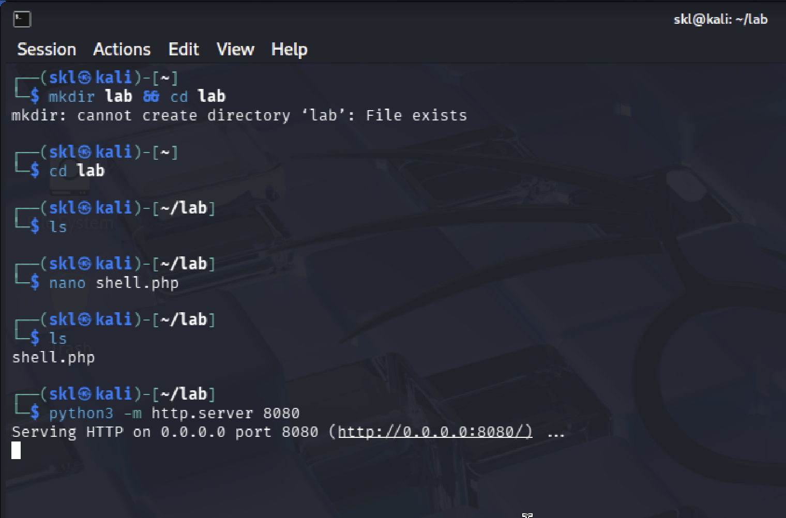
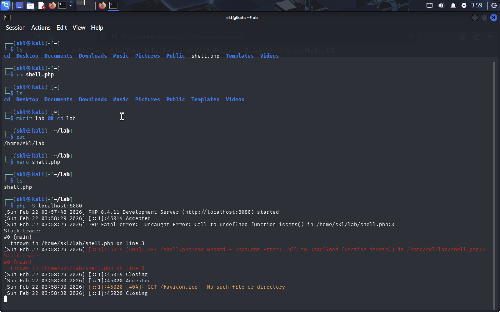

Step 2 - generate webshell
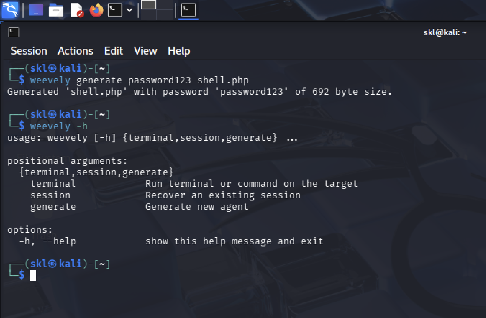

Feature Demonstrated :

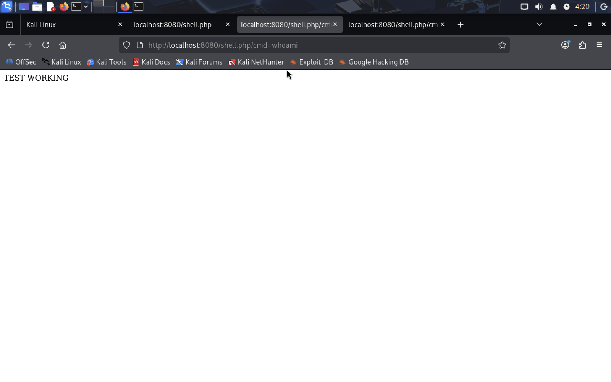
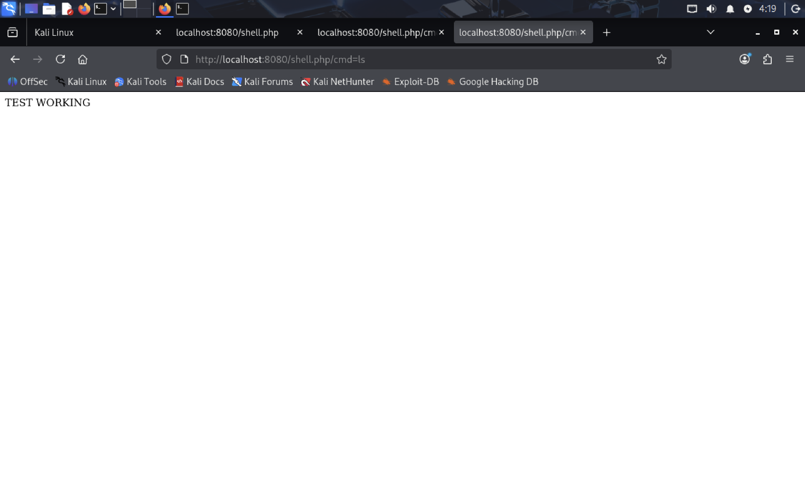

-Remote Command Execution
Allows execution of system-level commands via URL parameters.
- Persistent Backdoor Access
As long as the webshell file remains on the server, remote access is possible.
-Lightweight Deployment
The webshell requires only a small PHP file and minimal configuration.

Conclusion for Weevely

Weevely demonstrates how attackers can maintain persistent access through web-based backdoors. By generating a password-protected PHP shell, it highlights the risks associated with insecure web server configurations.

---
## 2️⃣ Cryptcat – Encrypted Communication Tool

### Features Demonstrated
- Help Menu Exploration  
- Listener Mode  
- Encrypted Client Connection  

### Purpose
Cryptcat establishes encrypted communication channels between systems.

### Security Relevance
It demonstrates how attackers can maintain secure remote sessions after initial compromise.

### Conclusion
Cryptcat emphasizes the importance of monitoring encrypted outbound connections and controlling unauthorized listeners.

Feature 1: Display Help Menu

Feature 2: Terminal 1 - Listerner Mode
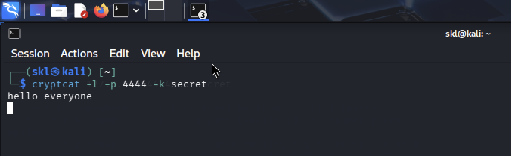

Feature 3: Terminal 2 - Local Encrypted Local connection
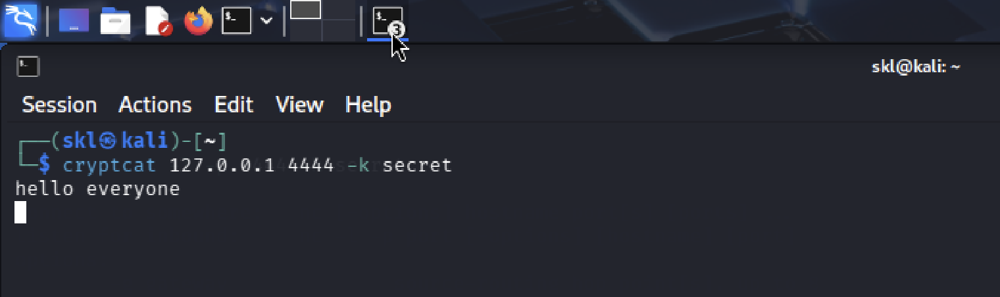

Conclusion for Cryptcat
Cryptcat enables encrypted communication between systems, making it useful for maintaining secure access during post-exploitation activities. By configuring listener mode and encryption keys, it demonstrates how secure remote sessions can be established and maintained in a controlled lab environment.

---
## 3️⃣ Webshell – Command Execution Script

### Features Demonstrated
- Script Creation  
- Command Execution Logic  
- Local Lab Demonstration  

> Demonstrated in controlled lab only. Not deployed externally.

### Purpose
A webshell allows remote command execution through a web-based interface if uploaded to a vulnerable server.

### Security Relevance
It highlights the risk of insecure file upload functionality and lack of input validation.

### Conclusion
Webshells demonstrate how simple scripts can enable persistent remote access, reinforcing the need for strict web security controls.

Feature 1: Display Help Menu
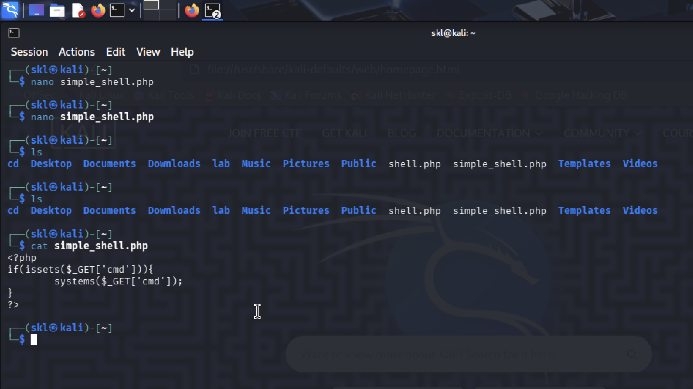

Note: The webshell was created and analyzed in a controlled lab environment for educational purposes only. It was not deployed to any external or unauthorized system.

Conclusion for Webshells

The webshell demonstration highlights how a simple script can be used to execute system commands remotely if uploaded to a vulnerable web server. Although the example was created in a controlled lab environment, it illustrates the serious security risks associated with improper file upload validation and insecure web server configurations.
This script demonstrates how a web-based backdoor can execute system commands if uploaded to a vulnerable server. It highlights the risks associated with improper file upload validation.

---

##  Task 2 Tool Comparison

| Tool      | Persistence Method            | Primary Risk                          |
|-----------|------------------------------|---------------------------------------|
| Weevely   | Stealth PHP backdoor         | Unauthorized web server control       |
| Cryptcat  | Encrypted communication      | Hidden remote sessions                |
| Webshell  | Web-based command execution  | Remote command abuse                  |

---

## Overall Task 2 Conclusion

The maintaining access tools demonstrate different persistence techniques including:

- Encrypted communication channels  
- Web-based backdoors  

Understanding these mechanisms is essential for implementing effective:

- Intrusion detection  
- Firewall policies  
- Secure coding practices  

---
##  References

1. **ChatGPT Shared Link**  
   https://chatgpt.com/share/699a2c77-2588-800f-a84a-2b383dd82ae7

2. **How Hackers Chat in Terminal (SECURELY!) | Cryptcat – Kali …**  
   https://youtu.be/nd54NLbmbP0 

3. **Web Hacking for Beginners #19 How To Use Weevely PHP Backdoor**  
   https://youtu.be/Y1gY5En6MsM

4. **YouTube Video (zZc6L5II90c)** How Hackers Bypass Website File Upload Filters (Upload WebShell Backdoor) | picoCTF - byp4ss3d**  
   https://youtu.be/zZc6L5II90c

5. **YouTube Video (hQ_0XBClqI0)** Hackers Love This Trick: Web Shell Upload Demo & Explained**  
   https://youtu.be/hQ_0XBClqI0

6. **YouTube Video (bnIrhbNpX-I)** 59. Generating a PHP backdoor with Weevely - Post exploitation - The Complete Ethical Hacking Class** 
   https://youtu.be/bnIrhbNpX-I

